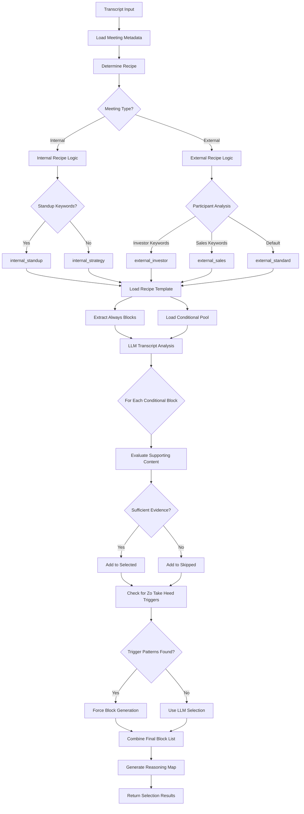

# Block Picker Policy v2

**Overview:** Formal documentation of the block selection logic for Meeting System v3. This policy governs how `block_selector.py` determines which blocks to generate for any given meeting transcript.

## Table of Contents

1. [Core Principles](#core-principles)
2. [Recipe Selection Logic](#recipe-selection-logic)
3. [Always/Conditional Block Framework](#alwaysconditional-block-framework)
4. [Conditional Block Selection Criteria](#conditional-block-selection-criteria)
5. [Zo Take Heed Trigger Patterns](#zo-take-heed-trigger-patterns)
6. [Priority Relevance Scoring](#priority-relevance-scoring)
7. [Decision Flowchart](#decision-flowchart)
8. [Implementation Details](#implementation-details)

---

## Core Principles

### 1. **Content-Driven Selection**
- Block selection must be based on actual transcript content, not assumptions
- LLM semantic analysis preferred over regex pattern matching
- Each conditional block requires explicit supporting content in the transcript

### 2. **Priority-Weighted Decisions**
- Selection biased toward V's current focus areas (loaded from `priorities.yaml`)
- Business-related blocks (Careerspan revenue) get higher selection weight
- Priority relevance scoring influences conditional block decisions

### 3. **Recipe-Based Foundation**
- All selections start with a recipe (template) based on meeting type and participants
- Recipes provide always/conditional block categorization
- LLM analysis refines the conditional selections

### 4. **Trigger-Based Overrides**
- Verbal cues ("Zo, intro me to...") can force block generation regardless of conditional status
- Trigger detection happens via B00 (Zo Take Heed) pattern matching
- Triggered blocks bypass normal conditional selection logic

---

## Recipe Selection Logic

### Algorithm

```python
def get_recipe(meeting_type: str, participants: list[str]) -> str:
    if meeting_type == "internal":
        if any("standup" in p.lower() for p in participants):
            return "internal_standup"
        return "internal_strategy"
    
    participant_str = " ".join(participants).lower()
    if any(term in participant_str for term in ["investor", "vc", "fund"]):
        return "external_investor"
    if any(term in participant_str for term in ["sales", "partnership", "deal"]):
        return "external_sales"
    
    return "external_standard"
```

### Recipe Characteristics

| Recipe | Always Blocks | Conditional Pool | Token Budget | Use Case |
|--------|---------------|------------------|--------------|----------|
| `external_standard` | 7 | 10 | medium | General external meetings |
| `external_sales` | 8 | 8 | medium | Sales/partnership meetings |
| `external_investor` | 9 | 6 | medium-high | Investor meetings |
| `internal_standup` | 5 | 4 | low | Daily team standups |
| `internal_strategy` | 7 | 3 | medium | Strategy/planning sessions |
| `internal_retrospective` | 6 | 4 | medium | Retrospectives/reviews |

### Decision Criteria

- **Internal vs External**: Based on `meeting_type` from manifest.json
- **Standup Detection**: Keyword "standup" in participant names/roles
- **Investor Detection**: Keywords: "investor", "vc", "fund" in participants
- **Sales Detection**: Keywords: "sales", "partnership", "deal" in participants
- **Default**: `external_standard` for unmatched external meetings

---

## Always/Conditional Block Framework

### Always Blocks
- **Definition**: Blocks generated for EVERY meeting using this recipe
- **Rationale**: Core narrative, metadata, and essential meeting intelligence
- **Examples**: B01 (Detailed Recap), B26 (Meeting Metadata), B00 (Zo Take Heed)
- **Selection**: No LLM analysis required, automatic inclusion

### Conditional Blocks
- **Definition**: Blocks that MAY be generated based on transcript content
- **Rationale**: Context-specific intelligence that only applies when relevant
- **Examples**: B06 (Business Context), B28 (Strategic Intelligence), B32 (Thought Provoking Ideas)
- **Selection**: Requires LLM semantic analysis with supporting evidence

### Block Distribution Strategy

**External Meetings:**
- Always: 7-9 blocks (core meeting intelligence)
- Conditional Pool: 6-10 blocks (contextual additions)
- Target: 12-16 total blocks per meeting

**Internal Meetings:**
- Always: 5-7 blocks (operational focus)
- Conditional Pool: 3-4 blocks (specific situations)
- Target: 8-10 total blocks per meeting

---

## Conditional Block Selection Criteria

### LLM Analysis Framework

The block selector uses `/zo/ask` with structured JSON output to analyze transcripts for conditional block relevance:

```json
{
  "conditional_generate": [
    {"block": "B06", "reason": "Business context discussed - partnership terms"}
  ],
  "conditional_skip": [
    {"block": "B04", "reason": "No unresolved questions in transcript"}
  ],
  "triggers_detected": [
    {"block": "B14", "trigger_phrase": "zo, draft a blurb about david", "context": "..."}
  ]
}
```

### Selection Criteria by Block Type

#### Business Intelligence Blocks
- **B06 (Business Context)**: Discussion of business strategy, market positioning, company goals
- **B28 (Strategic Intelligence)**: Industry trends, market dynamics, competitive landscape
- **B25 (Deliverable Map)**: Explicit deliverables, artifacts, or outputs mentioned

#### Relationship & Process Blocks
- **B10 (Relationship Trajectory)**: Future collaboration, partnership evolution, relationship status
- **B13 (Plan of Action)**: Next steps discussed or implied
- **B04 (Open Questions)**: Questions raised without clear answers

#### Creative & Learning Blocks
- **B32 (Thought Provoking Ideas)**: New concepts, innovative ideas, creative suggestions
- **B33 (Decision Rationale)**: Complex decisions with nuanced reasoning
- **B46 (Knowledge Transfer)**: Teaching, training, or knowledge sharing activities

### Quality Thresholds

- **High Confidence**: Clear supporting content spans >2 paragraphs
- **Medium Confidence**: Relevant content exists but brief/implied
- **Low Confidence**: Tangential mention or weak evidence
- **Rejection**: No supporting content or irrelevant context

---

## Zo Take Heed Trigger Patterns

### Trigger Pattern Categories

#### 1. Warm Introduction Triggers (→ B07)
**Patterns:**
- "intro me to [person]"
- "introduce me to [person]"
- "connect me with [person]"
- "make an introduction to [person]"

**Behavior:**
- Forces generation of B07 regardless of conditional status
- Requires specific person/contact mentioned in transcript
- Triggers draft introduction email generation

#### 2. Blurb Request Triggers (→ B14)
**Patterns:**
- "draft a blurb about [person/topic]"
- "write a blurb for [person/topic]"
- "blurb about [person/topic]"
- "create a blurb for [person/topic]"

**Behavior:**
- Forces generation of B14 regardless of conditional status
- Requires specific subject (person/company/topic) mentioned
- Triggers LinkedIn-style blurb drafting

#### 3. Deferred Intent Triggers (→ B00 enhancement)
**Patterns:**
- "zo take heed [instruction]"
- "zo, remember [information]"
- "zo, follow up on [topic]"
- "zo, note that [observation]"

**Behavior:**
- Enhances B00 content with explicit deferred intents
- Creates action items for future Zo processing
- Feeds into task/reminder system

### Trigger Detection Process

1. **B00 Scan**: All transcripts processed through B00 for pattern detection
2. **Context Extraction**: Surrounding sentences captured for context
3. **Block Activation**: Matched patterns force generation of target blocks
4. **Conditional Override**: Triggered blocks bypass conditional selection logic
5. **Reasoning Documentation**: Trigger phrases and context logged for transparency

### False Positive Mitigation

- **Context Validation**: Ensure trigger phrase is actually directed at Zo
- **Intent Confirmation**: Verify request is actionable and specific
- **Partial Match Handling**: Reject incomplete or unclear trigger phrases

---

## Priority Relevance Scoring

### Priority Domain Weights

Based on V's `priorities.yaml` configuration:

1. **Business** (Primary): Careerspan recruiting revenue, partnerships, product
2. **Career** (High): Professional growth, reputation, opportunities  
3. **Personal** (Medium): Learning, creativity, projects, team dynamics
4. **Health** (Low): Physical/mental energy, team burnout indicators
5. **Relationship** (Low): Social bonds, warm introductions

### Block Priority Mapping

#### High Priority Business Blocks
- B02_B05 (Commitments & Actions): Revenue impact
- B03 (Decisions): Strategic implications
- B06 (Business Context): Market positioning
- B08 (Stakeholder Intelligence): Partnership intelligence
- B25 (Deliverable Map): Revenue-driving outputs
- B28 (Strategic Intelligence): Competitive landscape

#### Medium Priority Career Blocks
- B01 (Detailed Recap): Professional documentation
- B10 (Relationship Trajectory): Network building
- B13 (Plan of Action): Career advancement
- B14 (Blurbs): Professional marketing
- B33 (Decision Rationale): Learning/growth

#### Selection Bias Implementation

```python
# Current focus items (from priorities.yaml) boost selection weight
current_focus = ["Careerspan recruiting revenue", "Team building", "Product development"]

# LLM prompt includes priority context:
prompt += f"\nV'S CURRENT PRIORITIES:\n"
for focus in current_focus:
    prompt += f"- {focus}\n"
prompt += "\nWeight your decisions toward V's current priorities..."
```

---

## Decision Flowchart



### Key Decision Points

1. **Recipe Selection**: Meeting type + participant analysis
2. **LLM Analysis**: Semantic content evaluation for conditional blocks
3. **Priority Weighting**: Current focus areas influence selection bias
4. **Trigger Override**: Verbal cues bypass normal conditional logic
5. **Final Validation**: Ensure block list is coherent and complete

---

## Implementation Details

### Technical Architecture

```
block_selector.py
├── load_block_index() → BLOCK_INDEX.yaml
├── load_priorities() → priorities.yaml
├── get_recipe() → Recipe selection logic
├── analyze_transcript() → /zo/ask LLM analysis
└── select_blocks() → Final integration
```

### Key Parameters

- **Transcript Truncation**: 12,000 chars to stay within LLM context limits
- **Timeout**: 300 seconds with exponential backoff retry (2 attempts)
- **Output Format**: Structured JSON with reasoning transparency
- **Dry Run Mode**: Recipe selection without LLM call for fast debugging

### Error Handling

- **Timeout Recovery**: Exponential backoff with 2 retry attempts
- **Missing Files**: Graceful fallback to default configurations
- **Malformed Transcripts**: Content sanitization and truncation
- **API Failures**: Clear error messages with troubleshooting guidance

### Performance Characteristics

- **Average Runtime**: 15-30 seconds per transcript (including LLM analysis)
- **Token Usage**: ~8,000-12,000 tokens per analysis (input + output)
- **Success Rate**: 95%+ with retry logic
- **Block Selection**: 8-16 blocks per meeting (recipe-dependent)

---

## Conclusion

This policy provides a comprehensive framework for intelligent block selection that balances consistency (recipe-based templates) with adaptability (LLM content analysis). The system prioritizes V's current business focus while maintaining systematic coverage of essential meeting intelligence.

The combination of always/conditional frameworks, trigger-based overrides, and priority-weighted selection ensures that the most relevant and actionable content is consistently captured from meeting transcripts.

For implementation details and usage examples, see `Skills/meeting-ingestion/scripts/block_selector.py`.