# Mermaid Syntax Reference

For generating flowcharts that render natively in Excalidraw with hand-drawn aesthetic.

## Why Only Flowcharts?

Excalidraw's Mermaid integration only renders **flowcharts** as native hand-drawn elements. All other Mermaid diagram types (sequence, class, ER, gantt, etc.) are rendered as rasterized images — defeating the aesthetic purpose.

**For non-flowchart diagrams, use raw Excalidraw JSON instead.**

## Flowchart Basics

### Direction
```
flowchart TB   %% Top to Bottom (default)
flowchart TD   %% Top Down (same as TB)
flowchart BT   %% Bottom to Top
flowchart LR   %% Left to Right
flowchart RL   %% Right to Left
```

### Node Shapes (Excalidraw-supported)

```mermaid
flowchart TD
    A[Rectangle]           %% Standard box
    B(Rounded Rectangle)   %% Rounded corners
    C{Diamond}             %% Decision
    D((Circle))            %% Circle/ellipse
```

**Note:** Other Mermaid shapes (hexagon, parallelogram, etc.) fall back to rectangles in Excalidraw.

### Connections

```mermaid
flowchart TD
    A --> B          %% Arrow
    A --- B          %% Line (no arrow)
    A -.- B          %% Dotted line
    A -.-> B         %% Dotted arrow
    A ==> B          %% Thick arrow
    A --text--> B    %% Arrow with label
    A -->|text| B    %% Alternative label syntax
```

### Labels on Nodes

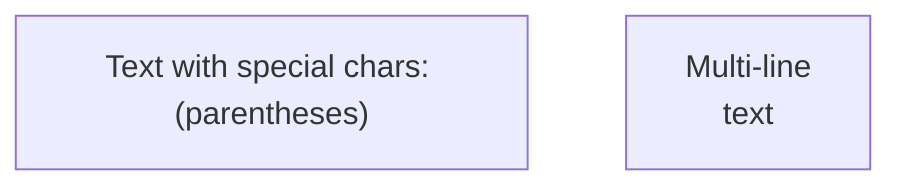

## Common Patterns

### Linear Process
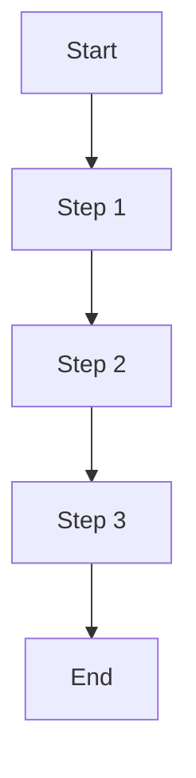

### Decision Tree
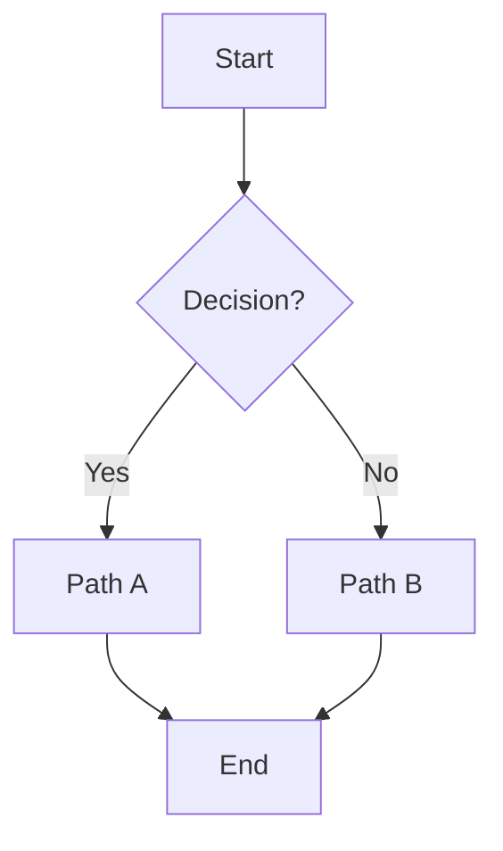

### Parallel Branches
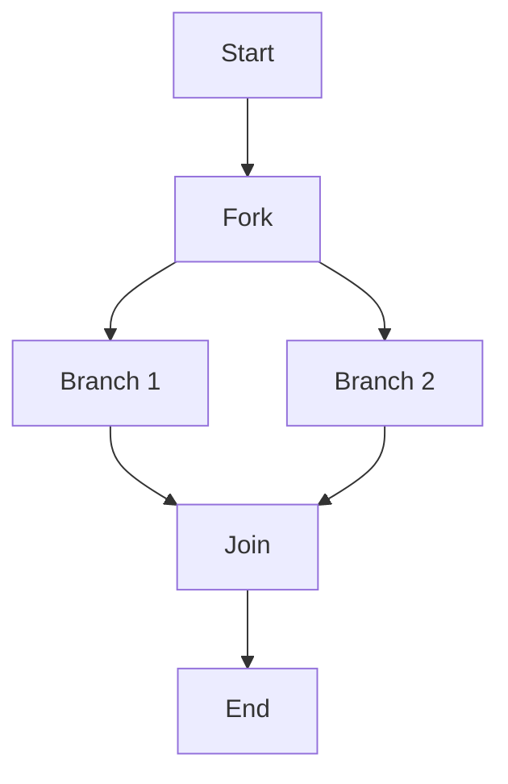

### Loop / Cycle
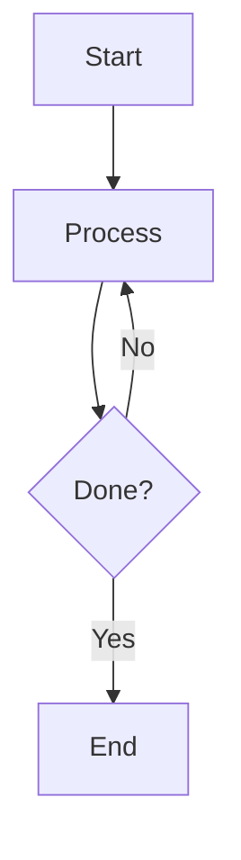

### Subgraphs (Grouped Sections)
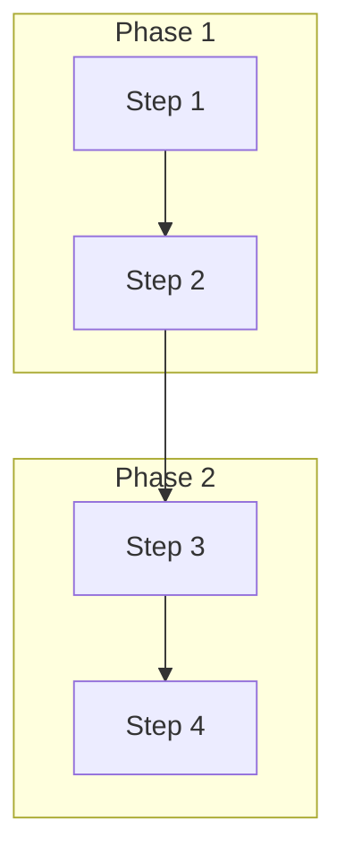

## Style Tips for Dark Theme

Excalidraw applies its own styling, but you can influence structure:

1. **Keep labels short** — Long text wraps awkwardly
2. **Use decision diamonds sparingly** — They take up space
3. **Prefer TD for vertical processes** — Reads naturally
4. **Use LR for timelines** — Horizontal flow
5. **Group related steps** — Use subgraphs for visual chunking

## Syntax Gotchas

### Reserved Words
Wrap in quotes:
```mermaid
flowchart TD
    A["end"]         %% "end" is reserved
    B["subgraph"]    %% "subgraph" is reserved
```

### Special Characters
Use quotes for parentheses, brackets, etc.:
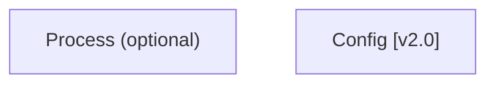

### Multi-line Labels
Use `<br>` or actual line breaks in quotes:
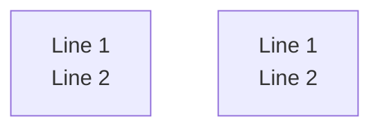

## Examples for Common Use Cases

### Simple Process
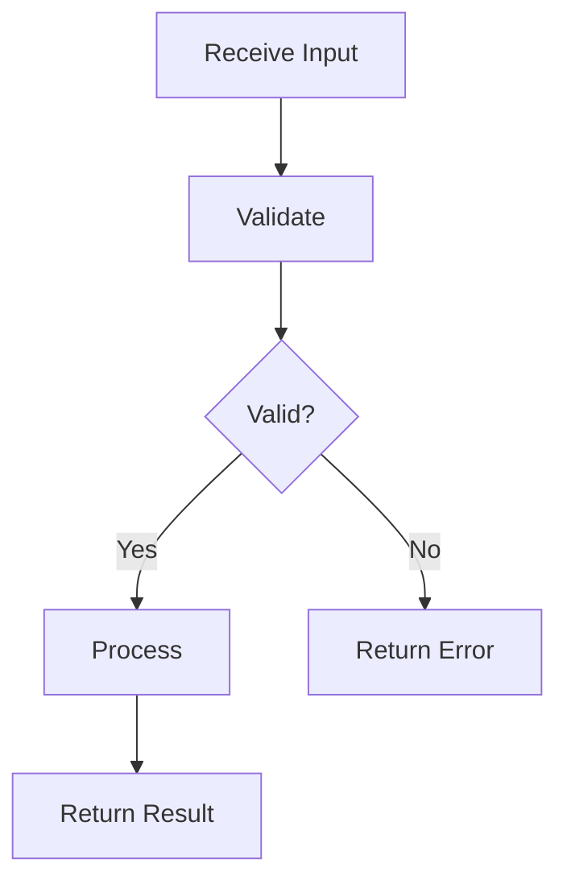

### Decision with Multiple Options
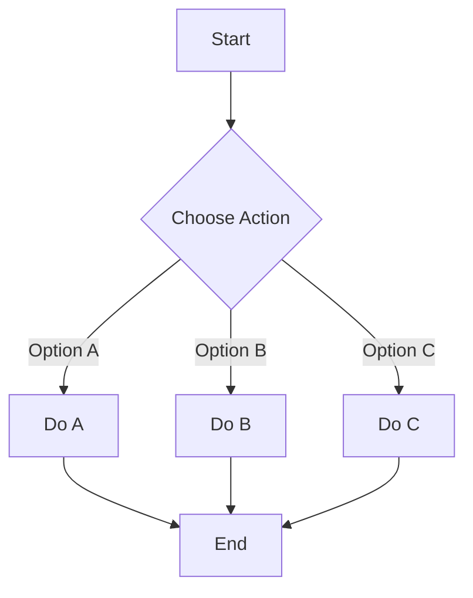

### Pipeline with Stages
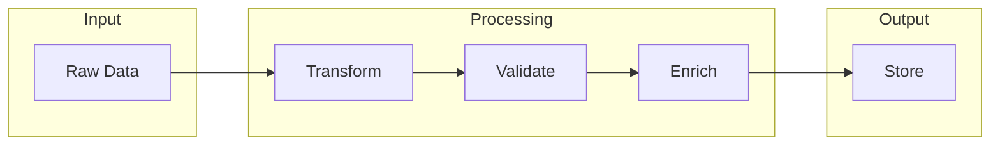

## When NOT to Use Mermaid

Use Excalidraw JSON instead when you need:
- **Mindmaps** — Mermaid mindmaps render as images
- **Custom layouts** — Precise positioning control
- **ER diagrams** — Render as images in Excalidraw
- **Timelines** — Render as images
- **Sequence diagrams** — Render as images
- **State diagrams** — Render as images
- **Non-standard shapes** — Custom styling
- **Mixed diagram types** — Combining different visuals
